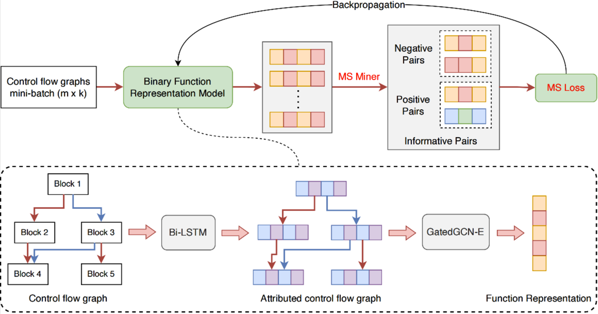

# Binary Code Similarity Detection with Multi-Similarity Loss

This is the source code of our solutions in CCF BDCI 2022 competition held on [DataFountain](https://datafountain.cn/competitions/593).
We introduce advanced miner and loss algorithms from Deep Metric Learning into Binary Code Similarity Detection.



## Environments
```
Python                    3.10.4
pytorch                   1.12.1 (py3.10_cuda10.2_cudnn7.6.5_0)
pytorch-lightning         1.7.3 
torch-geometric(PyG)      2.1.0
pytorch-metric-learning   1.5.2
scikit-learn              1.1.1 
```

## Run
```
bash train.sh && bash test.sh
```

## Results
Our model records are in `model/lstm_gatedgcn-e/version_0`.

|Model|Test MAP|
|---|---|
| Norm weighted miner + Triplet loss| 0.855586 |
| MS miner + Triplet loss | 0.883205 |
| **MS miner + MS loss (Ours)** | **0.922685** |

## Reference
- [Multi-Similarity Loss with General Pair Weighting for Deep Metric Learning](https://arxiv.org/abs/1904.06627)
- [CodeCMR: Cross-Modal Retrieval For Function-Level Binary Source Code Matching](https://keenlab.tencent.com/zh/whitepapers/neurips-2020-cameraready.pdf)
